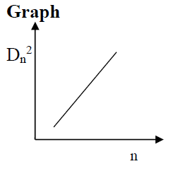

<h3>Precaution</h3>

1. Glass plate & lens should be clean to avoid the presence of dust particles between them.  

2. The lens should be of large radius of curvature.  

3. The glass plate should be inclined at angle of 450 with an incident light.  

4. Cross wire should be focused tangentially on ring.  

5. The source should be an external source.  

<h3>Procedure</h3>

1. Find the least count of traveling microscope.    

2. Arrange the apparatus as shown in fig so as to obtain Newton's ring.   

3. Select the ring; say 1st and 2nd for determining their radius.   

4. Set the vertical cross wire tangential to the 1st ring (left side first) Note down the readings.   

5. Repeat the step (4) for 2nd ring (left side).   

6. Set the cross wire on the 1st ring (Now on the ring side) & again note down the microscopic reading, repeat same procedure for 2nd ring (right side).   

7. Calculate the wavelength of light used.   
                                                                               |

 where,

MSR - Main Scale Reading.   
VSR - Vernier Scale Reading.   
TR - Total Reading. 

<h3> Graph </h3>

<h3>Result</h3>

1. Wavelength (λ) of a given light is ____ Å   
2. Standard value of Wavelength (λ) of a given light is ____ Å   
3. Percent Error in obtained result ____%
