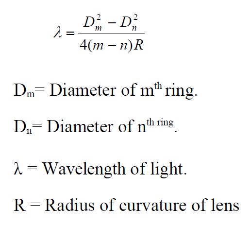
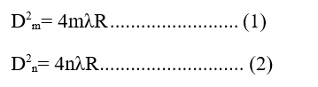
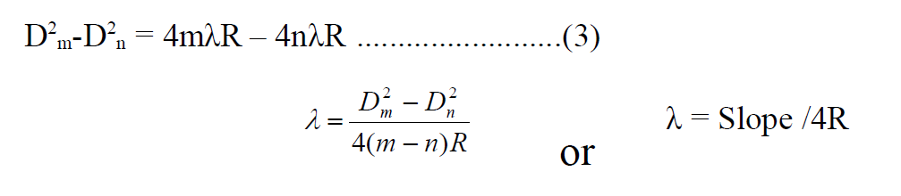
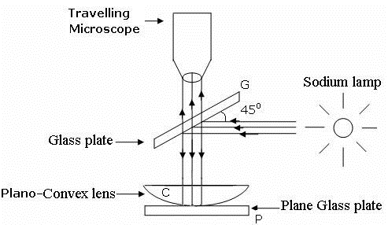
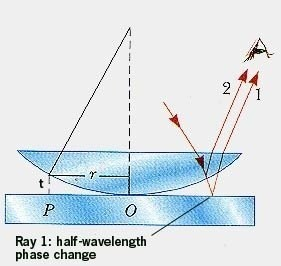
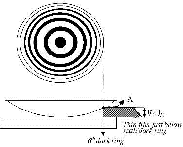

<h3> Apparatus </h3>

Travelling microscope, sodium vapor lamp, Newton’s ring apparatus.

 
<h3> Formula </h3>

<h3>  Prior Concept </h3> 

Monochromatic and Coherent source, Principle of superposition,
Interference, Path difference, thin film, Interference in thin film, condition for
Maxima and Minima for intensity of light etc.

<h3>  Theory </h3> 

Circular interference fringes produced by enclosing a thin air film of
varying thickness between the surface of a convex lens of large radius of curvature & plane glass, plate known as Newton’s ring. The light from a monochromatic source is rendered parallel by convex lens L. It is made to fall on a glass plate G inclined at angle 450 to the incident beam. It is made to fall on a glass plate ‘p’ as in diagram. Light rays reflected from top & bottom surface of the air film superimpose in such way to measure the diameter of the fringes.

The diameters of nth & mth dark fringes are given by, 

Subtracting these we get

Substituting the values in above equation we can find out the radius of curvature also.

<h3 >Diagram </h3>

